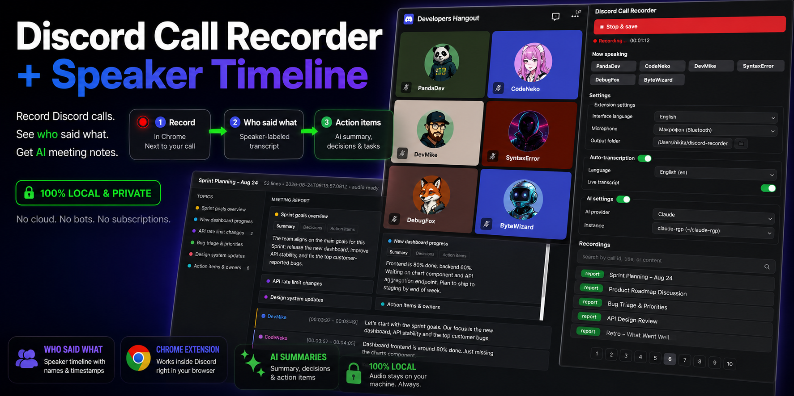

# Discord Call Recorder + Speaker Timeline



**Record any Discord call and get a transcript where every line says who said it — plus an AI summary with action items. All on your own machine.**

Ever left a long Discord call and immediately forgotten who promised what? This Chrome extension fixes that. While you're in a Discord **web** call it quietly does three things:

- 🎙 **Records the call** — the tab audio mixed with your microphone, saved as a compact `.webm`.
- 🗣 **Tracks who is speaking, second by second** — by watching Discord's own green speaking indicator, so no voice-fingerprinting guesswork is involved.
- 📝 **Transcribes and attributes every line** — whisper.cpp runs locally, the speaker timeline maps each sentence to the right person, and everything lands in a searchable SQLite database.

Then it goes further:

- ✅ **Meeting report** *(optional)* — Claude turns the transcript into a summary, key decisions and action items.
- ✏️ **Built-in editor** — click any line to replay that exact moment of audio, fix a name or a word, and your edits survive re-transcription.

**Private by design.** The audio never leaves your machine: recording, speaker detection and transcription are all local. The only optional network step is the Claude report, which uses your own Claude subscription.

## Requirements

| Component | Why | Version |
|---|---|---|
| Google Chrome | the extension + native messaging | any recent |
| Python | native host + transcription pipeline | 3.9+ (stdlib only, no pip packages) |
| ffmpeg | audio conversion / remux | any recent |
| whisper.cpp (`whisper-cli`) | local speech-to-text | any recent |
| Claude Code CLI (`claude`) | optional `--report` step (summary + action items) | optional |

## Installation (step-by-step)

### Step 1 — Clone the repository

```bash
git clone https://github.com/nikitacunskis/discord-meet-recorder.git
cd discord-meet-recorder
```

Keep the folder where you want it to live — the native host is registered with an
absolute path to it, so moving it later means re-running the installer (step 4).

### Step 2 — Install the dependencies

With [Homebrew](https://brew.sh):

```bash
brew install ffmpeg whisper-cpp
```

Python 3.9+ is also required; macOS ships with it (`python3 --version` to check),
and no pip packages are needed — the pipeline is stdlib-only.

Verify in a fresh terminal — all three must print something:

```bash
ffmpeg -version
whisper-cli --help
python3 --version
```

### Step 3 — Load the Chrome extension

1. Chrome → `chrome://extensions`
2. Enable **Developer mode** (top-right corner)
3. **Load unpacked** → pick the `extension/` folder of this repo
4. Copy the extension **ID** shown on the card — the next step needs it.

### Step 4 — Register the native host

The native host gives you auto-save into per-recording folders, automatic
transcription and the editor backend. Without it the panel still works, but files fall
back to Downloads and you transcribe manually.

```bash
./native/install.sh <extension-id>
```

Then **fully restart Chrome** (Cmd+Q, not just closing the window). After the restart
the "Native host" warning line in the extension panel must disappear.

### Step 5 — Whisper models

Nothing to do by default: on the first transcription the models are downloaded
automatically into `models/`.

To skip the automatic download (or reuse models you already have from another
whisper.cpp-based project), place these two files into `models/` yourself:

| File | Source project | Size |
|---|---|---|
| `ggml-large-v3-turbo.bin` | [whisper.cpp models](https://huggingface.co/ggerganov/whisper.cpp) | ~1.6 GB |
| `ggml-silero-v5.1.2.bin` | [Silero VAD (whisper.cpp build)](https://huggingface.co/ggml-org/whisper-vad) | ~2 MB |

```bash
mkdir -p models
curl -L -o models/ggml-large-v3-turbo.bin \
  https://huggingface.co/ggerganov/whisper.cpp/resolve/main/ggml-large-v3-turbo.bin
curl -L -o models/ggml-silero-v5.1.2.bin \
  https://huggingface.co/ggml-org/whisper-vad/resolve/main/ggml-silero-v5.1.2.bin
```

If another project on your machine already downloaded the same `ggml-*.bin` files,
copying (or symlinking) them into `models/` works too — the files are identical.

### Step 6 — Claude CLI (optional, for the `--report` step)

Install per [claude.com/claude-code](https://claude.com/claude-code)
(`npm install -g @anthropic-ai/claude-code`), then pick your instance in the
panel settings. Without it everything works except the generated summary /
action-items report.

## Usage

1. Open **discord.com** in a Chrome tab (the desktop app won't work — the extension cannot hear it!) and join a voice channel.
2. While on the Discord tab, click the extension icon → the side panel opens.
3. **● Start recording**. You keep hearing the call as usual. Keep the panel open while recording.
   - First time only: a microphone-permission page opens — allow it, then start again.
   - In Settings pick the same **Microphone** device Discord uses (virtual devices like
     "MS Teams Audio" record static). The level meter next to the record button shows
     live mic activity; a warning appears if the mic stays silent.
4. **■ Stop & save** → the recording lands in its own folder under `recordings/`,
   transcription starts automatically, and the recording list shows live status
   (audio → transcript → report). Click a recording to open the **editor** in a new tab:
   colored speakers, clickable rows that play the exact fragment, manual editing of
   speaker/time/text (persisted to SQLite, survives re-transcription).

If the native host is not available, the panel falls back to downloading the files into
Downloads; transcribe manually with:

```bash
python3 tools/transcribe.py ~/Downloads/discord-call-<date>.webm --report --claude claude-personal
```

Model: `large-v3-turbo` (the only option, ~1.6 GB, downloads itself on first run).
If the call is mostly in one language, add `--language ru` / `lv` / `en` for fewer hallucinations.

## Troubleshooting the native host

The panel shows a "Native host: not installed" warning when Chrome cannot start the
host. Check the registration file:

`~/Library/Application Support/Google/Chrome/NativeMessagingHosts/com.dvt.recorder.json`

The `allowed_origins` entry must contain your actual extension ID, and Chrome must
be fully restarted (Cmd+Q) after registration. The host runs with a minimal PATH;
the install script adds Homebrew and `~/.local/bin` itself.

## How transcription works

- The speaker timeline (from the DOM) drives everything: audio is cut into speech blocks,
  silence/music between blocks never reaches Whisper (that is where hallucination loops
  are born), each block gets its own language detection and no cross-block context.
- Speaker intervals shorter than 0.7 s are treated as noise; flickering intervals of the
  same speaker are merged first so real speech is not lost.
- Overlap heuristic: the beginning of an overlapping segment belongs to whoever started
  speaking first, the end to whoever finished last; both shown as `A → B` when significant.
- Storage: single SQLite DB `recordings/dvt.sqlite` with `recordings [id, base, dir,
  start_dt, end_dt]` and `text_lines [recording_id, speaker_name, speaker_line,
  start_dt_ms, end_dt_ms, edited]`. Hand-edited lines (`edited=1`) are never overwritten.

## Known limitations

- **Personal (DM) calls**: speaker detection needs the square participant tiles, not the
  round avatars. Start streaming anything (e.g. share your screen) — the tiles switch to
  the square layout and recording + transcription work as usual.
- The audio is a single mixed track; when two people talk at once the text goes to the
  dominant speaker (with the `A → B` marker when both contributed).
- Discord class hashes change with every build — selectors match substrings and the
  semantic `--status-speaking` CSS variable, so they usually survive updates. If the
  panel stops seeing speakers, the selectors need a refresh.
- The recording lives in memory until Stop: ~15 MB/hour, multi-hour calls are fine.
- Everything audible in the tab is recorded — including Discord beeps.

## Layout

```
extension/           Chrome MV3 extension (panel, DOM sensor, editor UI)
native/              native messaging host + install.sh
tools/transcribe.py  whisper.cpp pipeline: blocks, attribution, SQLite, Claude report
tools/dvtdb.py       shared SQLite schema (recordings, text_lines)
recordings/          one folder per recording + dvt.sqlite (your local data)
models/              whisper models (downloaded on first run)
```
